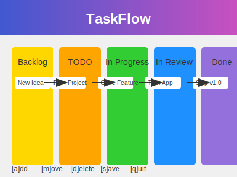

# TaskFlow: The Ultimate TODO List Manager



## Description

TaskFlow is a powerful command-line task management application that revolutionizes the way you organize and track your tasks. Built with Python, TaskFlow allows you to seamlessly move tasks through different stages of completion, mimicking a real-world workflow. Whether you're managing personal projects or coordinating team efforts, TaskFlow provides a flexible and intuitive system to keep everything on track.

## Key Features

- **Dynamic Task Stages**: Organize tasks across multiple stages - Backlog, TODO, In Progress, In Review, and Done.
- **Fluid Task Movement**: Easily shift tasks between stages as your work progresses.
- **Persistent Storage**: Save and load your task lists for continuous productivity.
- **Clean Command-line Interface**: Intuitive commands for swift task management.
- **Customizable Workflow**: Adapt the system to fit your personal or team workflow.

## How to Use

1. Launch TaskFlow:
   ```
   python taskflow.py
   ```

2. Main Menu Options:
   - `n`: Create a new task list
   - `l`: Load an existing task list
   - `q`: Exit TaskFlow

3. Task Management Menu:
   - `a`: Add a new task to the backlog
   - `m`: Move a task between stages
   - `d`: Delete a task
   - `s`: Save your current task list
   - `q`: Return to the main menu

## TaskFlow Structure

TaskFlow organizes your tasks in a structured flow:

1. **Backlog**: Initial ideas and tasks
2. **TODO**: Prioritized tasks ready for action
3. **In Progress**: Tasks currently being worked on
4. **In Review**: Completed tasks awaiting verification
5. **Done**: Successfully completed tasks

## Example Workflow

```
TaskFlow: The Ultimate TODO List Manager

Created by: Abhay Prasanna Rao

-----------------------------------------------------------------
MAIN MENU: [n]ew list, [l]oad list, or [q]uit?: n
backlog: []
todo: []
in_progress: []
in_review: []
done: []
-----------------------------------------------------------------
APPLICATION MENU: [a]dd to backlog, [m]ove item, [d]elete item, [s]ave list, or [q]uit to main menu?: a
Enter the item to add: Brainstorm project ideas
backlog: ['Brainstorm project ideas']
todo: []
in_progress: []
in_review: []
done: []
-----------------------------------------------------------------
APPLICATION MENU: [a]dd to backlog, [m]ove item, [d]elete item, [s]ave list, or [q]uit to main menu?: m
Enter the item to move: Brainstorm project ideas
Enter the list to add Brainstorm project ideas to: in_progress
backlog: []
todo: []
in_progress: ['Brainstorm project ideas']
in_review: []
done: []
...
```

## Creator

Abhay Prasanna Rao

## Tech Stack

- Python 3
- pickle: For data serialization
- sys: For system-specific parameters and functions

## Roadmap

- Task prioritization system
- Due date and reminder functionality
- Multi-user support with task assignment
- Data synchronization with cloud storage
- GUI version for desktop environments
